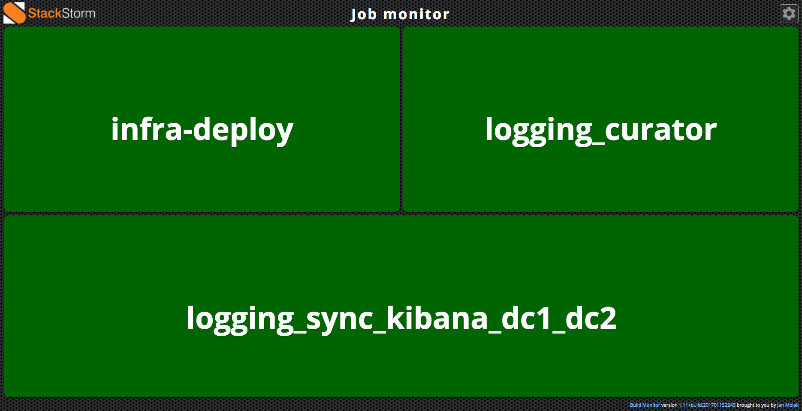

# StackStorm job monitor

With [StackStorm timers](https://docs.stackstorm.com/rules.html#timers) it's possible to execute batch jobs
periodically. With a dashboard it's easy to see which jobs are running and if their last status was success or failed.

Each batch job can be a workflow or action. Let's say we have a StackStorm my_job pack. The StackStorm job monitor
can show all the workflows/actions of the my_job pack. The complete frontend is derived from the awesome
[https://github.com/jan-molak/jenkins-build-monitor-plugin.git](https://github.com/jan-molak/jenkins-build-monitor-plugin.git).
All the data is retrieved with one JSON AJAX request to a Flask python application. The python application retrieves
and combines information from the StackStorm API into the proper dashboard format. View the *.py files in this
repository for more info.

## Steps to update this software

### 1) Get asset files
    git clone https://github.com/jan-molak/jenkins-build-monitor-plugin.git
    mv jenkins-build-monitor-plugin/build-monitor-plugin/src/main/webapp/* .

### 2) Verify if the HTML source code is still valid or needs updates

It's easiest to display the HTML source code of a Build Monitor View in an active Jenkins installation. Otherwise
you can look at [https://github.com/jan-molak/jenkins-build-monitor-plugin/blob/master/build-monitor-plugin/src/main/resources/com/smartcodeltd/jenkinsci/plugins/buildmonitor/BuildMonitorView/index.jelly](https://github.com/jan-molak/jenkins-build-monitor-plugin/blob/master/build-monitor-plugin/src/main/resources/com/smartcodeltd/jenkinsci/plugins/buildmonitor/BuildMonitorView/index.jelly)
